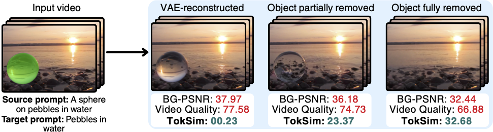
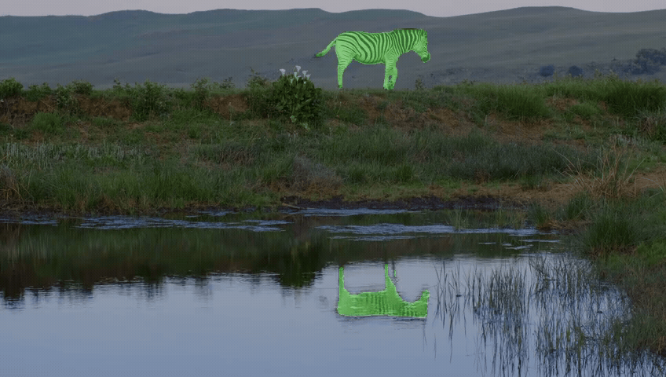

<h1 align="center">
  Object-WIPER  :  Training-Free Object and Associated Effect Removal in Videos
</h1>

<div align="center">
  <div class="is-size-5 publication-authors">
    <span class="author-block">
      <a href="https://sakshamsingh1.github.io/">Saksham Singh Kushwaha</a><sup>1,*</sup>,&nbsp;&nbsp;</span>
    <span class="author-block">
      <a href="https://sayannag.github.io/">Sayan Nag</a><sup>2</sup>,&nbsp;&nbsp;</span>
    <span class="author-block">
      <a href="https://www.yapengtian.com/">Yapeng Tian</a><sup>1</sup>,&nbsp;&nbsp;</span> 
    <span class="author-block">
      <a href="https://kuldeepkulkarni.github.io/">Kuldeep Kulkarni</a><sup>2</sup></span>
  </div>

  <div class="is-size-5 publication-authors">
    <span class="author-block"><sup>1</sup>The University of Texas at Dallas,&nbsp;&nbsp;</span>
    <span class="author-block"><sup>2</sup>Adobe Research</span>
  </div>

  <div class="is-size-6 publication-authors">
    <span class="author-block">(* Work done during an internship at Adobe)</span>
  </div>
</div>

<p align="center">
  <a href="https://arxiv.org/pdf/2601.06391"></a>
  <a href="https://sakshamsingh1.github.io/object_wiper_webpage/"></a>
  <a href="https://huggingface.co/datasets/sakshamsingh1/WIPER-bench"></a>
</p>

---
**Object-WIPER** is a training-free method for removing objects and their associated effects by leveraging video priors. We also introduce a real-world associated-effect benchmark and **TokSim**, a metric for evaluating object removal quality.


## 🗞️ News: 
* **Toksim:** A new evaluation object removal metric.
* **WIPER-Bench:** A new real-world object removal benchmark. ([Link](https://huggingface.co/datasets/sakshamsingh1/WIPER-bench))


## 🛠️ Installation

```bash
conda create -n toksim python=3.11 -y
conda activate toksim

# You may have to change the versions
pip install torch==2.4.0 torchvision==0.19.0 torchaudio==2.4.0 --index-url https://download.pytorch.org/whl/cu121

conda install -c conda-forge ffmpeg -y
pip install av transformers pillow
```

## ⚖️ TokSim

  <p align="center">
    
  </p>

  Unlike other metrics, Toksim scores very high only when the object is fully removed and progressively becomes lower as the object removal reduces.

<details style="margin-top: -5px;">
  <summary><strong>More about Toksim</strong></summary>

  <p align="center">
    
  </p>

</details>

```bash
cd toksim
python sample_run.py
```
<h3 align="center">Examples</h3>

| Input Video | Prediction 1 | Prediction 2 |
| :---: | :---: | :---: |
| </img> <br> TokSim score: | </img><br> 33.19 | </img><br> 22.37 |
| </img> <br>TokSim score: | </img><br> 22.54 | </img><br> 16.82 |

## 🤗 Citation
```
@article{kushwaha2026object,
  title={Object-WIPER: Training-Free Object and Associated Effect Removal in Videos},
  author={Kushwaha, Saksham Singh and Nag, Sayan and Tian, Yapeng and Kulkarni, Kuldeep},
  journal={arXiv preprint arXiv:2601.06391},
  year={2026}
}
```

## 📧 Contact

If you have any questions, suggestions, or run into issues, please open an issue or contact [sxk230060@utdallas.edu](mailto:sxk230060@utdallas.edu).
